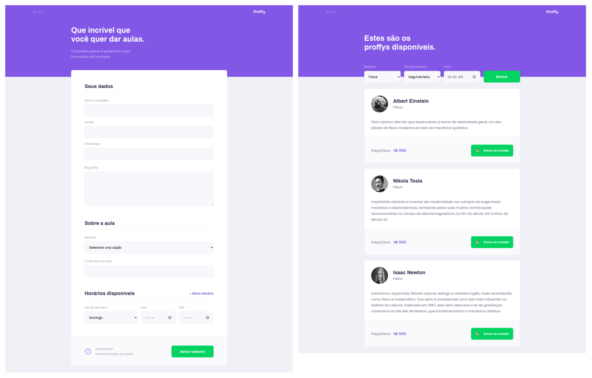
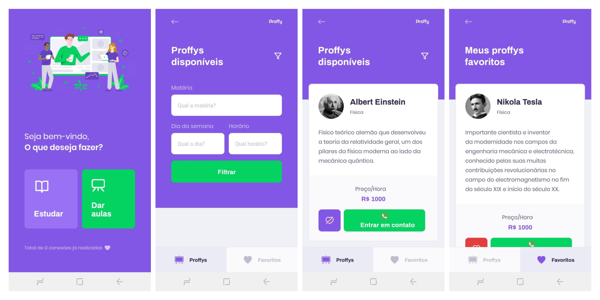

<h1 align="center">
    
</h1>

  <a href="#-projeto">Projeto</a>
  &nbsp;&nbsp;&nbsp;|&nbsp;&nbsp;&nbsp;
  <a href="#-tecnologias">Tecnologias</a>
  &nbsp;&nbsp;&nbsp;|&nbsp;&nbsp;&nbsp;
  <a href="#-aplicação">Aplicação</a>

    

## ✦ Projeto

O Proffy foi o sistema desenvolvido durante o evento NLW da Rocketseat. O projeto consistiu na implementação de uma aplicação completa (front, back, app) que possui como objetivo conectar professores e alunos das mais diversas áreas. Tendo como princípio o conceito mobile first.

## ✦ Tecnologias
Esse projeto foi desenvolvido com as seguintes tecnologias:

**Web:**
- [ReactJS](https://pt-br.reactjs.org/)
- [React Router](https://reactrouter.com/web/guides/quick-start)

**Server:**
- [Knex](http://knexjs.org/)
- [Express](https://expressjs.com/pt-br/)
- [SQLite3](https://www.sqlite.org/index.html)

**Mobile:**
- [React Native](https://reactnative.dev/)
- [React Navigation](https://reactnavigation.org/)
- [Async Storage](https://reactnative.dev/docs/asyncstorage)
- [Expo](https://expo.io/)

## ✦ Aplicação
**Web e Mobile:**

    

**Server:**
Funcionalidades implementadas:
- Conexões
  - Criar conexões
  - Listar total de conexões
- Aulas
  - Criar aula
  - Listar aulas

**Mobile:**

    

---

O projeto foi desenvolvido para fins didáticos e aprendizado pessoal durante o evento Next Level Week 2

